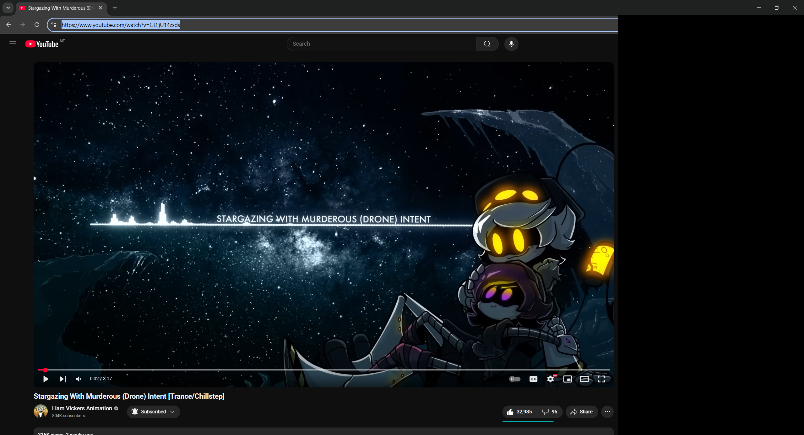
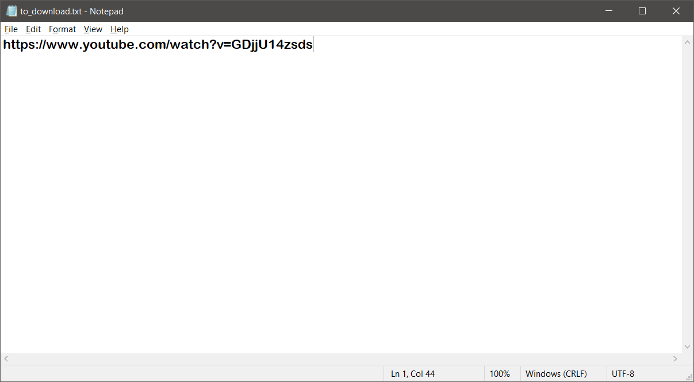
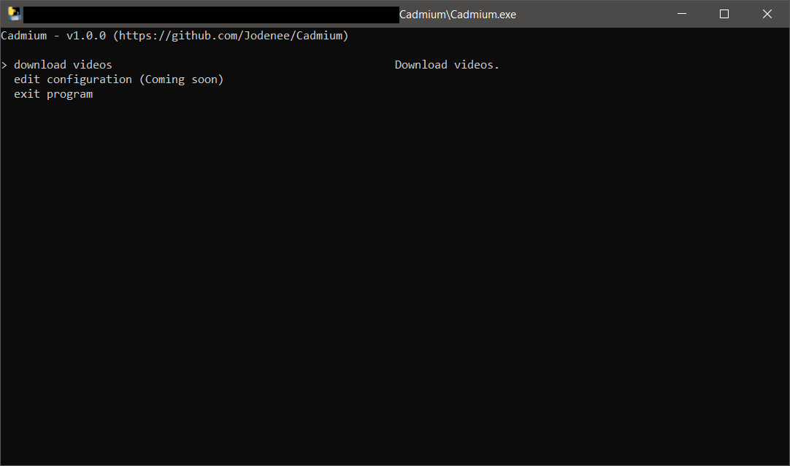
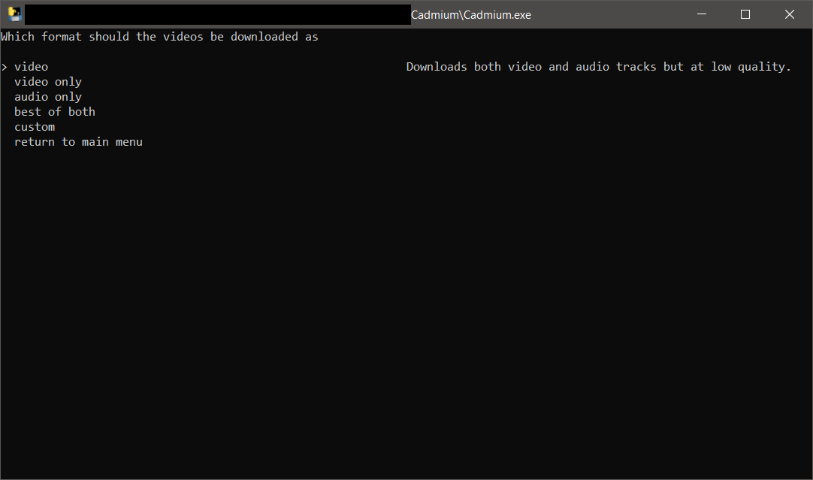
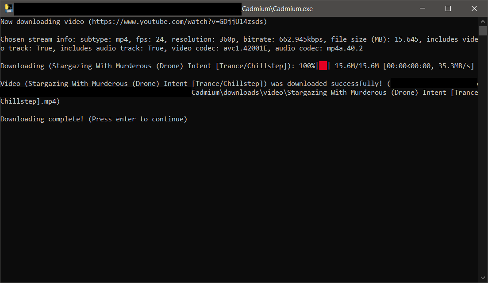
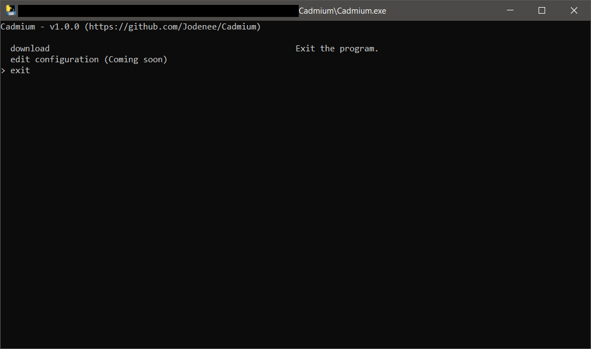
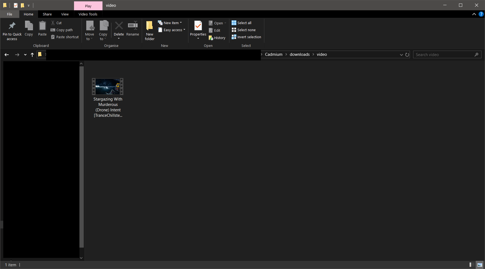

# Using Cadmium
This tutorial will go over how you can use Cadmium, as well as some other concepts.

## Basic Concepts

### Selection menu controls (VERY IMPORTANT)

You can move the curser up and down with either the `up arrow key` and `down arrow key` OR pressing `w` and `s` on your keyboard.

To confirm your choice or selection press [Enter] on your keyboard.

To select multiple options press the `right arrow key` or `d` on your keyboard.

### `configuration.json`
Cadmium stores it's configurations inside `configuration.json`. To learn how to edit Cadmium's configurations please use this [tutorial](./configuration.md). 

### `to_download.txt`
Cadmium will read the `to_download.txt` file to know what to download. It accepts urls of videos, shorts, playlists and channels.

Each url should be put on a new line. So your `to_download.txt` should resemble something like this when downloading multiple things.

```txt
https://www.youtube.com/watch?v=Td7CBNu0914
https://www.youtube.com/shorts/CLghk_feulE
https://www.youtube.com/playlist?list=PLHovnlOusNLiJz3sm0d5i2Evwa2LDLdrg
https://www.youtube.com/@Deathbrains
```

### The `downloads` Folder
The downloads folder is the default location where files downloaded by Cadmium end up, the downloads folder is organized by "Download Format" to make finding your videos easier and maintaining good organisation. 

### Download Formats
A download format refers to how media files, like videos or audio, are packaged and saved during download, each impacting their quality, type, and file size.

| Download Format  | Description                                                                                                                       | Use Cases                                                             |
|------------------|-----------------------------------------------------------------------------------------------------------------------------------|-----------------------------------------------------------------------|
| **Video**        | Downloads a file containing both video and audio but at a **low quality**                                                         | Useful for quick downloads with average quality with limited storage  |
| **Video Only**   | Downloads a file only containing video but at a very **high quality**                                                             | Best for high-quality video downloads that do not need audio          |
| **Audio Only**   | Downloads a file only containing audio but at a very **high quality**                                                             | Perfect for music or podcasts where video is unnecessary              |
| **Best of Both** | Downloads two files, one containing the video and the other containing the audio but at **high quality**                          | Ideal for full media experiences, such as movies or shows             |
| **Custom**       | Downloads a variable amount of files, each file can contain either only video or only audio or containing both at **any quality** | Used for more fine-grain control over which stream is downloaded      |

## Steps

## 1. Finding what to download
Before downloading anything you first need to find what you want to download on youtube, remember that you can download videos, shorts, playlists and entire channels. For this tutorial a single video will be downloaded for the sake of simplicity however the same process can be done for shorts, playlists and channels as well.



### 2. Fill in the `to_download.txt` file.
Before running Cadmium first open the `to_download.txt` file and fill it in with urls of desired media to download. Once that is done the file must be **saved** and closed.



### 3. Open Cadmium
> Please note that if this is your first time running Cadmium, you may get a pop up from your antivirus software or windows, while this is expected behavior it may cause some unrest, so if at any point you are not comfortable with the prebuilt executable a [tutorial](../tutorials/building_cadmium.md) exists to show you how to build Cadmium yourself.

Once cadmium is opened, choose the "download" option using the up and down arrow keys or wasd and press [Enter].



### 4. Format Selection
After that you will be prompted to select a format for your media. Please refer to [this table](#download-formats) for a description of each their use case.



### 5. Download Process
Now Cadmium will begin the downloading process. After the downloading is done you will be prompted to continue.



### 6. Exiting Cadmium
After you will be taken back to the main menu, to exit select the "exit" option.



### 7. Finding The Downloaded Media
After exiting Cadmium your downloaded files will be located inside the `downloads` folder in the subfolder with the same name as the format selected in step 4. Enjoy!

If you enabled download location overrides in `configuration.json` you media can be found in the path you have specified.


