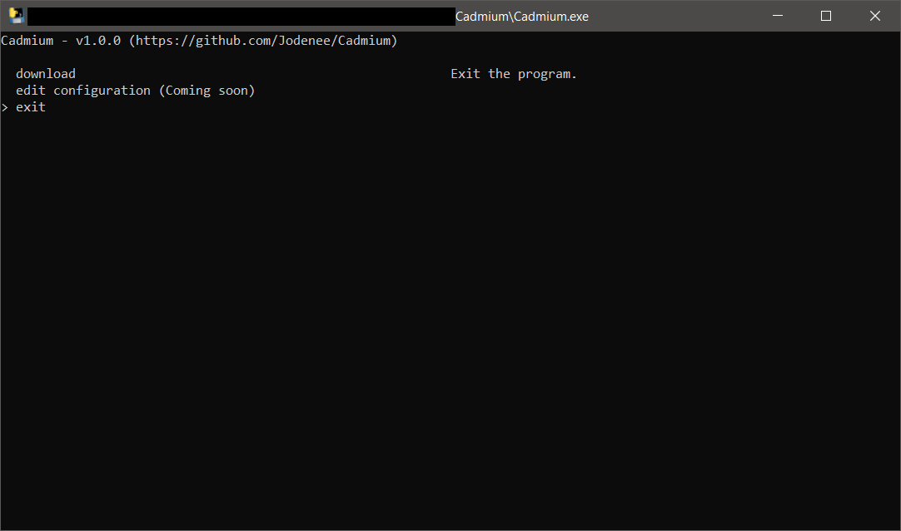

# Using Cadmium
This tutorial will go over how you can use Cadmium, as well as some other concepts.

## Basic Concepts

### `configurations.json`
Cadmium stores it's configurations inside `configurations.json`. To learn how to edit Cadmium's configurations it is encouraged to look at this [tutorial](./configuration.md). 

### `to_download.txt`
Cadmium will read the `to_download.txt` file to know what to download. It accepts urls of videos, shorts, playlists and channels.

Each url should be put on it's own line. So your `to_download.txt` should resemble something like this.

```txt
https://www.youtube.com/watch?v=Td7CBNu0914
https://www.youtube.com/shorts/CLghk_feulE
https://www.youtube.com/playlist?list=PLHovnlOusNLiJz3sm0d5i2Evwa2LDLdrg
https://www.youtube.com/@Deathbrains
```

### The `downloads` Folder
The downloads folder is the default location for downloads of any kind by Cadmium, the downloads folder is organized by Download Format to make finding your videos easier while maintaining good organization. 

### Download Formats
A download format refers to how media files, like videos or audio, are packaged and saved during download, each impacting their quality, type, and file size.

| Download Format  | Description                                                                      | Use Cases                                                 |
|------------------|----------------------------------------------------------------------------------|-----------------------------------------------------------|
| **Video**        | Downloads both video and audio tracks in one file but at **low quality**.        | Useful for quick downloads with limited storage.          |
| **Video Only**   | Downloads only the video track but at **high quality**.                          | Best for high-quality visuals without audio.              |
| **Audio Only**   | Downloads only the audio track but at **high quality**.                          | Perfect for music or podcasts where video is unnecessary. |
| **Best of Both** | Downloads both the video and audio tracks in 2 separate files but at **high quality**. (Tip: Enabling the `merge_best_of_both_downloads_into_one_file` configuration will result in 1 video file containing the best video and audio, read more here.) | Ideal for full media experiences, such as movies or shows. |
| **Custom**       | Downloads streams of your choosing, allowing for a tailored download experience. | Great for advanced users who want specific content.       |


## Steps

## 1. Finding media to download
First before downloading you first need to find what you want to download, you can download videos, shorts, playlists and channels. For this tutorial a single video will be downloaded for the sake of simplicity.


### 2. Fill in the `to_download.txt` file.
First before opening Cadmium the `to_download.txt` file must be filled with urls of desired videos to download. Once that is done the file must be saved and closed.


### 3. Open Cadmium
Once cadmium is opened, choose the "download" option using the up and down arrow keys and press [Enter].


### 4. Format Selection
After that you will be prompted to select a format for your media.


### 5. Download Process
After selecting the format Cadmium will begin the downloading process. After the downloading is done you will be prompted to continue, simply press the [Enter] key.


### 6. Exiting
After you will be taken back to the main menu, to exit select the "exit program" option using the up and down arrow keys and press [Enter].



### 7. Finding The Downloaded Media
After exiting Cadmium your media will be located inside the `downloads` folder that can be found in the same folder as Cadmium.

If you enabled download location overrides in `configuration.json` you media can be found in the path you have specified.


